# 1. Data & Preprocessing
[Titanic](https://www.kaggle.com/c/titanic/data)

## 1.1. Features
| Variable	| Definition |	Key |
| :---: | :---: | :---: |
| survival	|Survival	|0 = No, 1 = Yes|
|pclass	|Ticket class|	1 = 1st, 2 = 2nd, 3 = 3rd|
|sex	|Sex	| |
|Age	|Age| in years|
|sibsp|	# of siblings / spouses aboard the Titanic|	|
|parch|	# of parents / children aboard the Titanic	||
|ticket|	Ticket number	||
|fare	|Passenger fare	||
|cabin|	Cabin number	||
|embarked|	Port of Embarkation	C = Cherbourg, Q = Queenstown, S = Southampton||

## 1.2. Exploration
### 1.2.1. Data
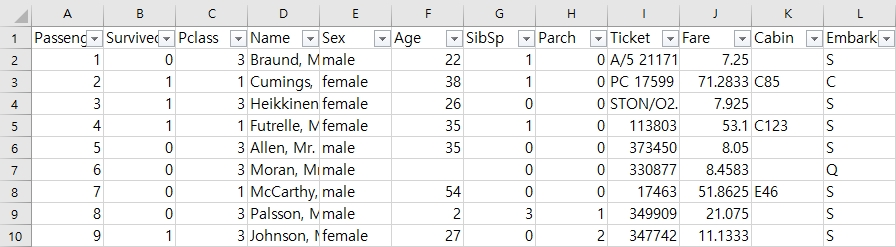

### 1.2.2. Nan values

```py
> train_data.info()
<class 'pandas.core.frame.DataFrame'>
RangeIndex: 891 entries, 0 to 890
Data columns (total 12 columns):
PassengerId    891 non-null int64
Survived       891 non-null int64
Pclass         891 non-null int64
Name           891 non-null object
Sex            891 non-null object
Age            714 non-null float64
SibSp          891 non-null int64
Parch          891 non-null int64
Ticket         891 non-null object
Fare           891 non-null float64
Cabin          204 non-null object
Embarked       889 non-null object
dtypes: float64(2), int64(5), object(5)
memory usage: 83.7+ KB

> test_data.info()
<class 'pandas.core.frame.DataFrame'>
RangeIndex: 418 entries, 0 to 417
Data columns (total 11 columns):
PassengerId    418 non-null int64
Pclass         418 non-null int64
Name           418 non-null object
Sex            418 non-null object
Age            332 non-null float64
SibSp          418 non-null int64
Parch          418 non-null int64
Ticket         418 non-null object
Fare           417 non-null float64
Cabin          91 non-null object
Embarked       418 non-null object
dtypes: float64(2), int64(4), object(5)
memory usage: 36.0+ KB
```

- **Imputing 필요 variables** <br>
`Age` (20%): row 제거 혹은 타 변수들로부터 추정 <br>
`Cabin` (92%): 1st class를 제외하고는 선실을 가지지 않는다. column 제거 혹은 의미가 있는 값이라고 판단될 시 가족관계를 통해 추정 (가족은 동일한 선실을 사용) <br>
`Embarked` (2개): row 제거 <br>
`Fare` (1개): row 제거

### 1.2.3. Numerical variables
Nan값을 가진 row를 모두 제거한 712개의 train data(추정치 포함 X)에 대해 분석 <br>

```py
> train_data.hist(bins=50, figsize=(20, 15));
```
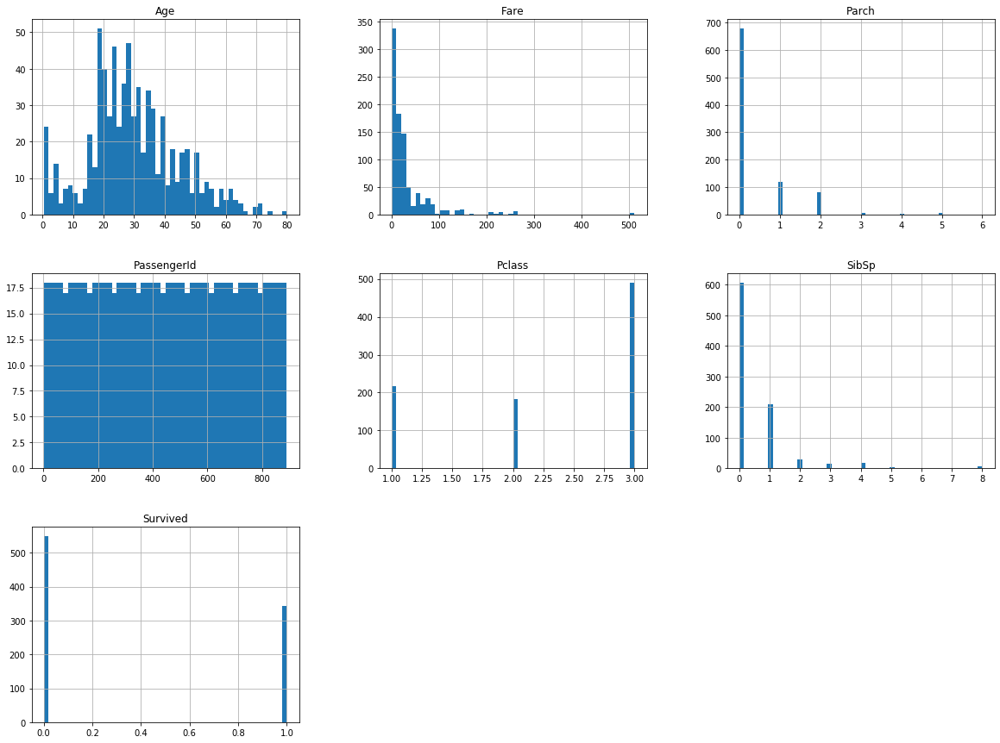
- `Fare`: log scale로 변경
- `PassengerId`는 타 변수들과 무관하다고 판단되어(아래 scatter plot 참조) 제거
- `Pclass`: dummy variables로 변경
- `SibSp`, `Parch`: 두 값을 합쳐서 `Household`로 만들 수 있다.

#### 1.2.3.1. Plotting and correlation analysis
```py
> np.triu(np.ones_like(corr)) * train_data.corr()
```
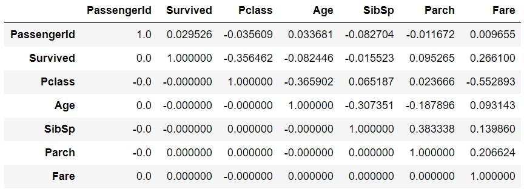

```py
> from pandas.plotting import scatter_matrix
> scatter_matrix(train_data, figsize=(15, 15))
```
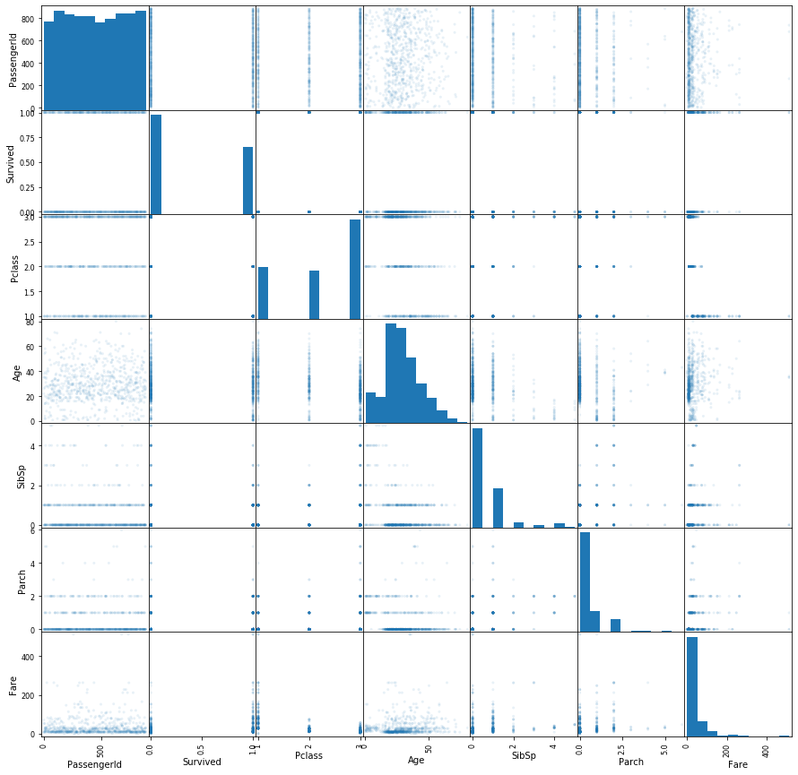

- `PassengerId` <br>
타 변수들과 유의한 관계가 보이지 않는다.(최대 0.08) 제거하는 것이 바람직하다. <br>
특히, 가족은 비슷한 `PassengerId`를 갖지 않는데 후에 `Name`으로 정렬을 통해 의미있는 feature를 추가할 수 있을 것이다.
<details>
<summary> 가족은 동일한 성(Name)과 SibSp, Parch, Ticket, Fare, Cabin, Embarked를 가지고, 동일한 Survived값을 가지는 경향이 있다. </summary>
<div markdown="1">

*Goodwin* Family → `Survived`: 0 <br>
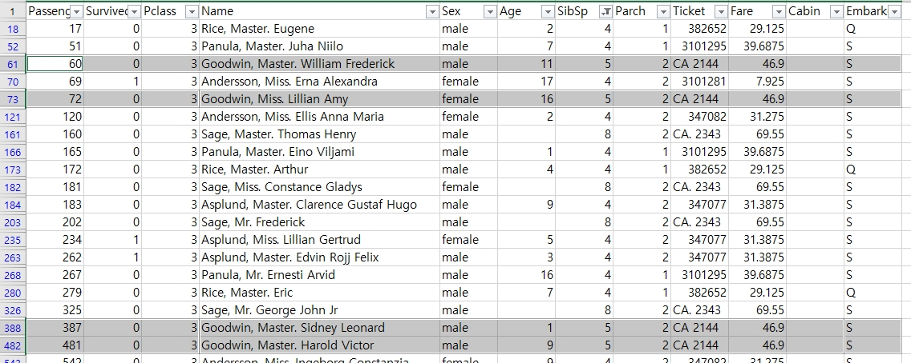 <br>

</div>
</details>

- `Survived` <br>
`Pclass`가 작을수록(-0.36), `Fare`가 클수록(0.27) 생존하는 경향이 상대적으로 가장 크다.(`Pclass`가 약 1.3배 정도 더 높은 경향성을 가진다) <br>
즉, 부유층일수록 생존할 확률이 높다는 경향성을 무시할 수 없다. <br>

- `Pclass` <br>
`Age`가 작을수록(-0.37) `Pclass`가 증가하는 경향성을 보인다. <br>
또한, `Fare`와 강한 음의 상관관계(-0.55)를 보인다. <br>
기본적으론 numerical value로 되어 있지만, categorical value로 변환하는 것이 바람직하다. <br>

- `Age` <br>
`SibSp`가 작아질수록(-0.31) `Age`가 증가하는 경향성을 보인다. <br>
마찬가지로, `Parch`도 작아질수록(-0.19) `Age`가 증가하는 경향을 보인다. <br>
히스토그램을 살펴보면 11세 정도를 cutpoint로 하는 방법도 고려해볼만하다. <br>

- `SibSp` <br>
`Parch`가 커질수록(0.38) `SibSp`도 증가하는 경향성을 보인다. <br>
`Fare`도 약한 양의 상관관계(0.14)를 가진다. <br>

- `Parch` <br>
`Fare`가 커질수록(0.21) `Parch`도 증가하는 약한 경향성을 보인다. <br>

- `Fare` <br>
Exponentially decaying하기 때문에 log를 취해 좀 더 고른 분포로 만들면 더 강한 상관관계를 얻을 수 있다. <br>

### 1.2.3.2. Preprocessing
- **Feature Engineering** <br>
1. Remove `Nan` values
1. `log(Fare)` = ln(1 + `Fare`) <br>
2. Split `Pclass` into `1st class`, `2nd class`, `3rd class` <br>
3. `Household` = `SibSp` + `Parch` <br>
3. Manual correction (`log(Fare)` == 0)
5. Split `Age` with cutpoint 11 <br>
4. Standardization

- **Imputing** <br>
`Age`와 `Cabin`에 대한 imputing은 modeling의 feedback을 받으며 진행한다. <br>

- **Correlation Results**
Age (Total) <br>

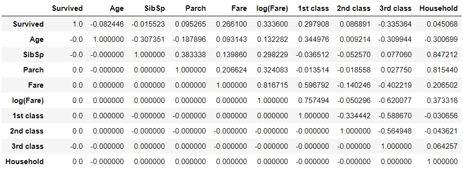 <br>
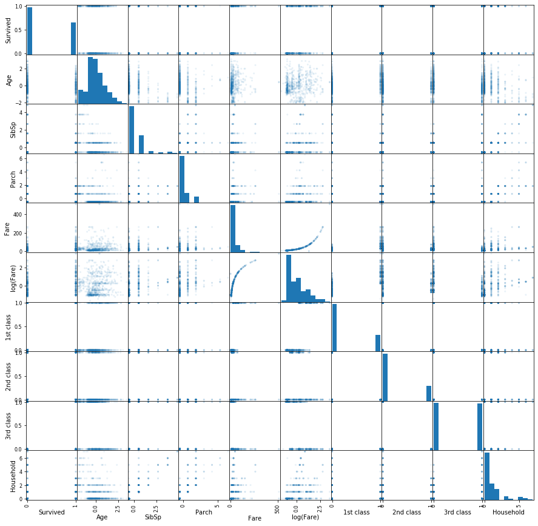 <br>

<br>
Age (≤ 11) <br>

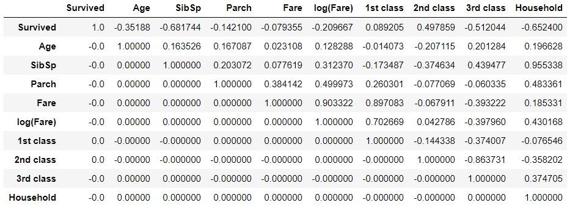 <br>
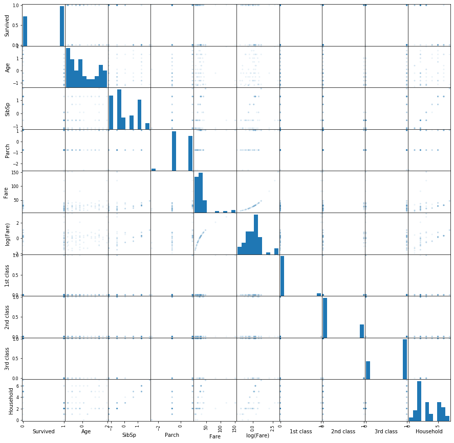 <br>

<br>
Age (＞11) <br>

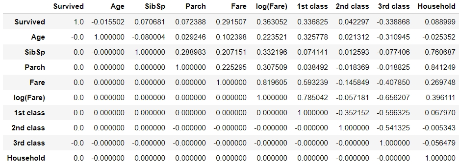 <br>
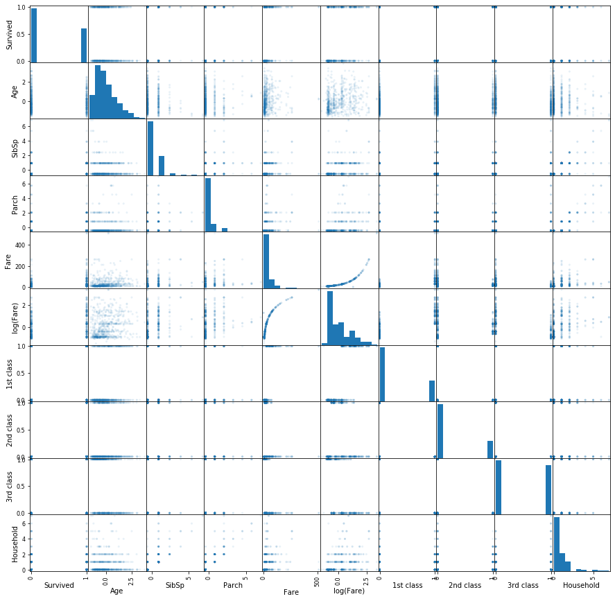 <br>

### 1.2.4. Categorical variables
- `Sex`: `Male`, `Female`로 분리 <br>
- `Name`: `Last name`, `Title`, `First name`으로 분리 후, `Title`을 `Mr`, `Mrs`, `Miss`로 모은 다음, `Title`을 제외한 나머지 변수들 제거 <br>
- `Cabin`: 첫글자 알파벳만 `Deck`으로 사용하고, nan값은 'Unknown'으로 처리 <br>
- `Ticket`, `Embarked`: 제거 <br>
